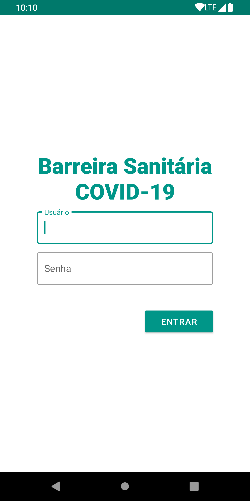
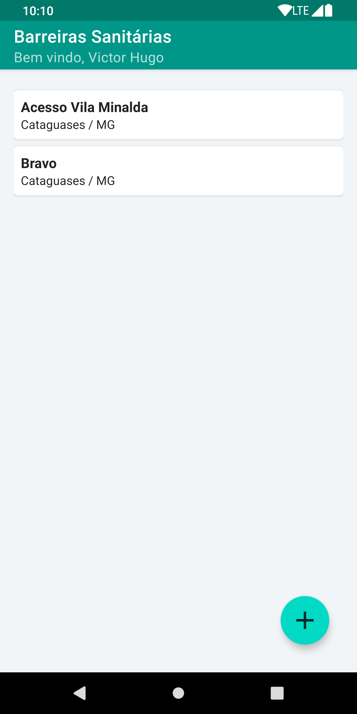
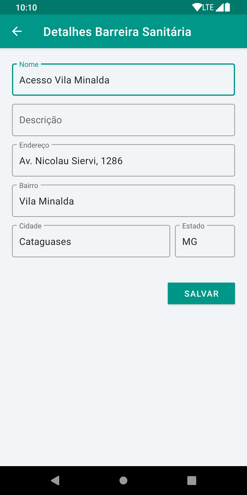
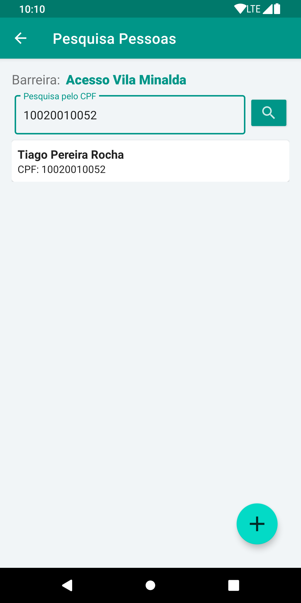
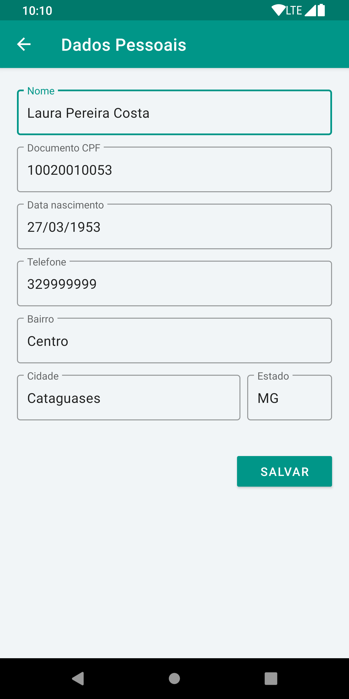
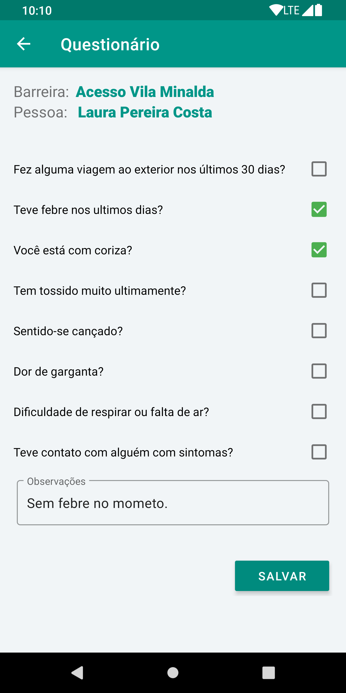

## Java x Kotlin
Código fonte utilizado no artigo **Um estudo comparativo sobre as Linguagens Java e Kotlin para o desenvolvimento de aplicativos para Android** como trabalho de conclusão de curso.

## Tecnologias

**Android Studio**: versão 3.6.3

**Java**: versão 8

**Kotlin**: versão 1.3

## Estudo de Caso
O aplicativo Barreiras Sanitárias, tem como objetivo fazer o cadastro de
pessoas que passam pelo local da instalação da barreira sanitária, além do registro, a
pessoa é convidada a responder um questionário referente aos sintomas da COVID-19.

No aplicativo também é possível fazer o cadastro de localidades das barreiras
sanitárias, com nome, localização e endereço, além de ter a pesquisa de já
cadastrados, através do documento da pessoa, funcionalidade que permite responder
novamente ao questionário.

#### Fluxo do aplicativo
 Usuário faz o login, vai para a tela de Listas de Barreiras Sanitárias, nesse momento pode selecionar uma (para prosseguir) ou cadastrar uma nova barreira. Ao selecionar a barreira, vai para a tela de Pesquisa de Pessoa, caso não encontre pode cadastrar uma nova pessoa. Após selecionar pessoa vai para a tela de questionário. Finalizando a ação no aplicativo volta para a tela de pesquisa de pessoa.

#### Telas

|| | |
|-|-|-|
||| |

#### Base de dados
Não foi utilizado uma base de dados, porem foi aplicado uma estrutura de DAO e interfaces que possibilitem uma implementação real. As informações são salvas em  listas em memórias, nas classes *Dummy.........DAO*.   
