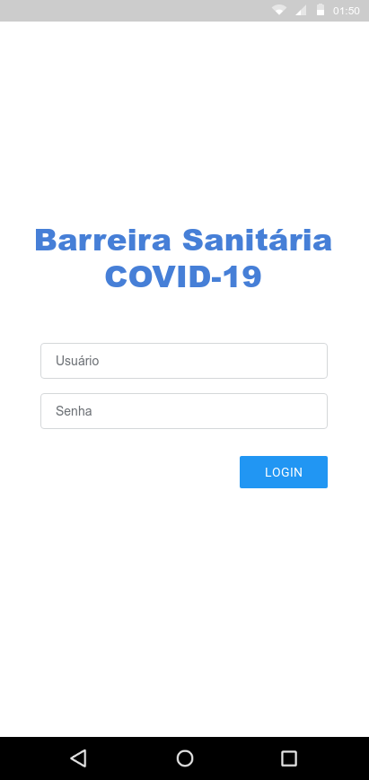
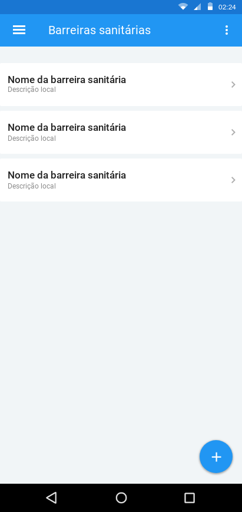
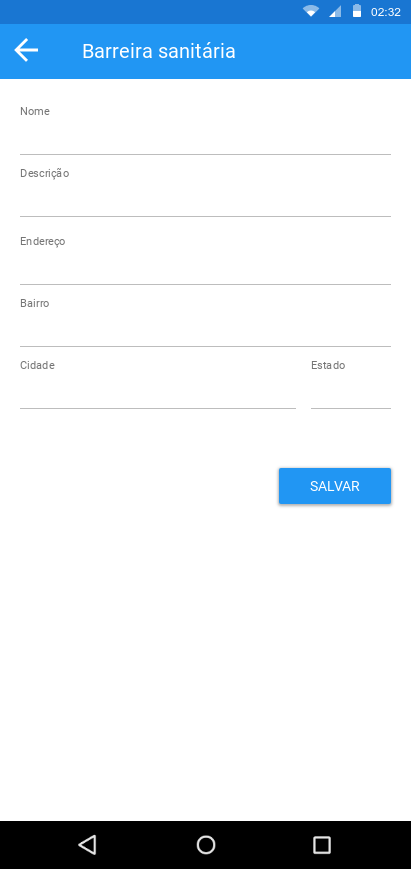
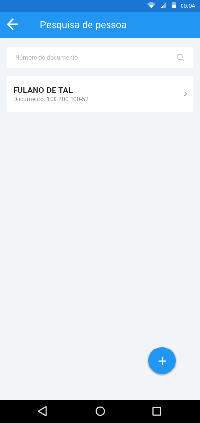
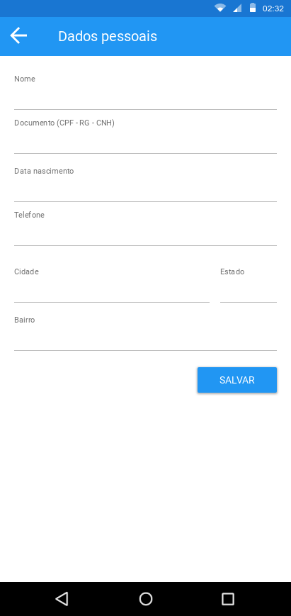
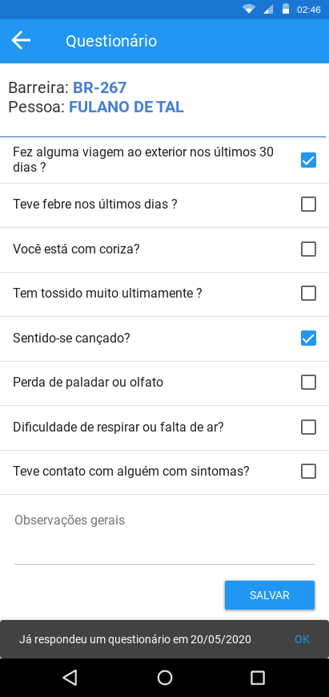

# Protótipo do aplicativo
A Ideia do aplicativo para comparação é um questionário para as barreiras sanitárias devido a Pandemia do COVID-19.

O fluxo no aplicativo: Usuário faz o login, vai para a tela de Listas de Barreiras Sanitárias, nesse momento pode selecionar uma (para prosseguir) ou cadastrar uma nova barreira. Ao selecionar a barreira, vai para a tela de Pesquisa de Pessoa, caso não encontre pode cadastrar uma nova pessoa. Após selecionar pessoa vai para a tela de questionário. Finalizando a ação no aplicativo volta para a tela de pesquisa de pessoa.

|| | |
|-|-|-|
||| |
